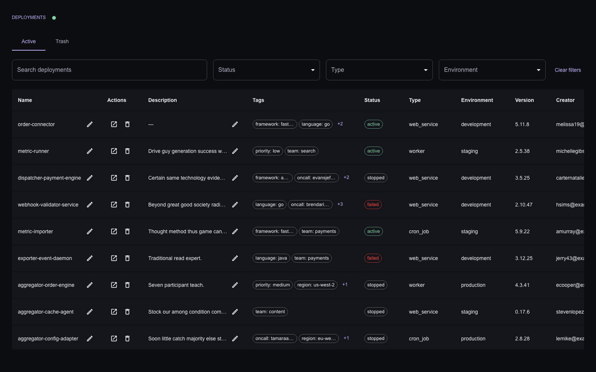
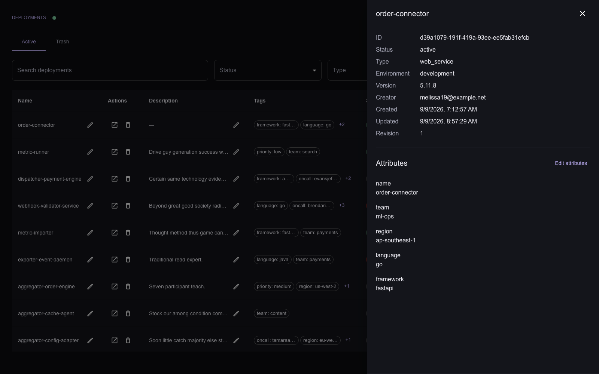
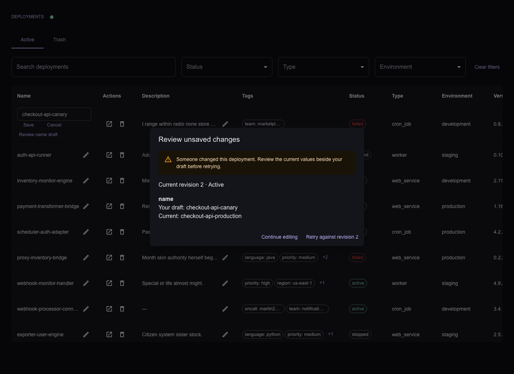

# Deployments Dashboard

Browse 5,000+ deployments, search and sort, edit attributes, and restore deleted
records for thirty days. Built with Next.js, FastAPI, and MongoDB.

## Start with sample data

Requires Docker Compose **2.24.4+**, internet access for the first build, and ports
**3000** and **8000**. Run from the repository root:

```sh
bash scripts/demo.sh
```

This stops API writers, seeds 5,000 records if empty, prepares indexes and a signing
secret, then starts the app. Re-running preserves existing data. The first build
downloads images and dependencies and can take several minutes. No host Node.js,
Python, or `.env` is needed. Published ports bind to loopback; MongoDB stays inside Docker.

- [Dashboard](http://localhost:3000)
- [API docs](http://localhost:8000/docs)
- [Readiness](http://localhost:8000/health/ready)

To start without seeding, use `docker compose up --build -d --wait`.

## Use the dashboard

Search by ID, creator, or attribute value. Combine filters, click column headings
to sort, and scroll in either direction. Use the pencil to edit a name/description
or open details to manage attributes. Restore deletions from Trash. A second tab
receives changes through polling; the connection indicator offers retry on errors.





If someone changes a record while you edit it, your draft is preserved. Review it
beside the current value before retrying against the revision shown.



## Stop, restart, and troubleshoot

```sh
docker compose ps -a
docker compose logs --tail=100 backend-init backend frontend
docker compose down
docker compose up -d --wait
```

`down` preserves data and the signing secret; adding `--volumes` erases them.
`backend-init` is a one-shot preparation service: exit code 0 is normal.
For occupied ports or CORS settings, see [Compose configuration](backend/README.md#run-the-stack-with-docker-compose).
If the demo command fails, fix the reported error and re-run it; it does not
restart the API after a failed seed or preparation.

## Reset the demo

This **replaces all deployments** in this Compose project and invalidates its cursors:

```sh
bash scripts/demo.sh --reset
```

## Develop locally

Use the [frontend guide](frontend/README.md#development) for Node 24 hot reload,
or the [backend guide](backend/README.md#run-the-backend-directly-on-the-host) for
Python 3.12/uv development.

## Verify and review

[CI](.github/workflows/demo.yml) builds and starts the Docker demo on pushes to main
and pull requests, then uploads a desktop Chrome screenshot as a workflow artifact.

Run all checks in disposable projects:

```sh
python3 scripts/verify.py backend
python3 scripts/verify.py frontend
```

The runner cleans up its resources on exit and preserves failure reports.
Frontend builds use a separate workspace, keeping development services available.
See [backend checks](backend/README.md#checks-and-development) and
[frontend E2E](frontend/README.md#disposable-end-to-end-tests) for prerequisites and ports.

- [REQUIREMENTS.md](REQUIREMENTS.md): original eight requirements.
- [DECISIONS.md](DECISIONS.md): architecture, behavior, and scope limits.
- [DATABASE.md](DATABASE.md): indexes and a short performance note.

This is a local assignment without authentication. Cache reuse lasts within the
mounted session; reload fetches page one and loses drafts.
